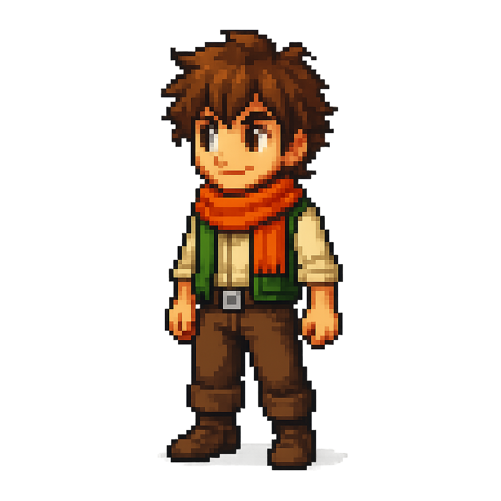

# 🎮 Bitcoin-Toshi: Quest for Truth

> Ein automatisiertes System, das Bitcoin-Bildungsgeschichten im Retro-RPG-Stil generiert, prüft und veröffentlicht.



## 🌟 Konzept

**Bitcoin-Toshi** ist ein innovatives Bildungsprojekt, das komplexe Bitcoin- und Blockchain-Konzepte durch nostalgische SNES-JRPG-Ästhetik vermittelt. Der Hauptcharakter **Toshi** – ein junger Held mit seinem charakteristischen orangen Schal – begleitet Lernende auf einer epischen Reise durch die Welt der Kryptowährungen.

### Warum RPG-Format?
- **Emotionale Bindung**: Spieler identifizieren sich mit dem Helden
- **Progressives Lernen**: Levelstruktur = Lernfortschritt
- **Gamification**: Komplexe Themen werden zu "Quests"
- **Nostalgie-Faktor**: 16-bit Ästhetik spricht Millennials & Gen-X an

## 🎨 Hauptcharakter: Toshi

| Eigenschaft | Details |
|-------------|---------|
| **Name** | Toshi (東志 – "Östliche Ambition") |
| **Alter** | ~16 Jahre (junger Held) |
| **Markenzeichen** | Oranger Schal (Bitcoin-Orange!) |
| **Farbschema** | Braun-Orange-Grün |
| **Stil** | 16-bit Pixel-Art (SNES-Ära) |
| **Persönlichkeit** | Neugierig, mutig, wissbegierig |

## 🗺️ Welten & Settings

1. **Blockchain-Wald** – Die Grundlagen: Was ist eine Blockchain?
2. **Mining-Höhlen** – Proof of Work, Miner, Hash-Rätsel
3. **Cyberstadt** – Wallets, Transaktionen, Nodes
4. **Die Festung der Banken** – Fiat vs. Bitcoin, Zentralisierung
5. **Der Berg der Wahrheit** – Satoshi's Vision, Whitepaper

## 🏗️ Technische Architektur

```
Bitcoin-Toshi/
├── 00_system_core/      # Basis-Skripte & Konfiguration
├── 01_agents/           # KI-Agenten
│   ├── image_analyzer/  # Bildanalyse & Konsistenzprüfung
│   ├── qa_publish/      # Quality Assurance & Publishing
│   └── orchestrator/    # Workflow-Steuerung
├── 02_models/           # Hugging Face API-Anbindung
├── 03_workflows/        # AgentFlow-Definitionen
├── 04_database/         # SQLite für Content-Management
├── 05_assets/           # Media-Dateien
│   ├── images/          # Generierte Bilder & Referenzen
│   ├── audio/           # Sounds & Musik
│   └── fonts/           # Pixel-Fonts
├── content/             # Generierter Content (Wochen-Struktur)
├── toshi-designs/       # Character-Designs & Style-Guides
├── Toshi-App/           # iOS/macOS App (SwiftUI)
└── docs/                # Dokumentation
```

## 🎯 Style-Blueprint-System

Das Herzstück der visuellen Konsistenz:

```
style_lab/ → Analyse → master_style/ → Blueprint → Generation
```

1. **Style Lab**: Referenzbilder werden analysiert
2. **Analyse**: KI extrahiert Stil-Parameter (Farbpalette, Linienführung, Pixel-Dichte)
3. **Master Style**: Kanonische Referenzen werden definiert
4. **Blueprint**: Automatische Style-Guides für neue Generationen
5. **Generation**: Konsistente neue Assets

### Verwendete Modelle (Hugging Face)
- **Qwen3-VL**: Vision-Language für Bildanalyse
- **joy-caption**: Automatische Bildbeschreibungen
- **Weitere**: Stable Diffusion Varianten für Pixel-Art

## 📱 Toshi-App (iOS/macOS)

Native SwiftUI-App für interaktives Lernen:
- **Lektionen** als RPG-Dialog-Szenen
- **Quiz-Elemente** im Kampf-Stil
- **Fortschritts-Tracking** (Level-System)
- **Offline-fähig** (Core Data)

## 📅 Content-Struktur

```
content/
├── Vorlagen/
│   └── Template_Post.txt    # Post-Template
├── Woche_01/                # Einführung
├── Woche_02/                # Blockchain Basics
├── Woche_03/                # Mining & Konsens
└── ...
```

Jede Woche enthält:
- 5-7 Posts (Text + Bild)
- 1 Quiz/Interaktion
- 1 Zusammenfassung

## 🇩🇪 Sprache & Stil

**Deutsche RPG-Dialoge im SNES-JRPG-Stil:**

```
┌─────────────────────────────────────┐
│ TOSHI                               │
├─────────────────────────────────────┤
│ "Diese Blöcke... sie sind alle      │
│  miteinander verbunden! Wie eine    │
│  Kette, die niemand brechen kann!"  │
└─────────────────────────────────────┘
```

- Kurze, prägnante Sätze
- Staunen & Entdeckung
- Mentor-Figuren erklären Konzepte
- Antagonisten = FUD, Scams, Unwissen

## 🎯 Zielgruppen

| Zielgruppe | Fokus |
|------------|-------|
| **Einsteiger** | Grundlagen, keine Vorkenntnisse nötig |
| **Gamer** | Nostalgie, Gamification |
| **Eltern/Lehrer** | Bildungsmaterial für Kinder/Jugendliche |
| **Investoren** | Projekt-Potenzial, Skalierbarkeit |
| **Entwickler** | Technische Architektur, API-Integration |

## 🚀 Roadmap

- [x] Character-Design finalisiert
- [x] Style-Blueprint-System entwickelt
- [x] Content-Pipeline aufgesetzt
- [ ] Woche 1-4 Content generieren
- [ ] iOS-App MVP
- [ ] Community-Launch
- [ ] Weitere Sprachen

## 📄 Lizenz

[Lizenz noch zu definieren]

## 👤 Kontakt

**Projekt-Owner:** Patrick (Pat Koe)

---

*"Jede Reise beginnt mit einem einzelnen Block."* – Toshi
